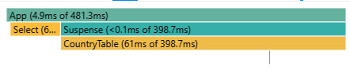
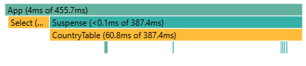
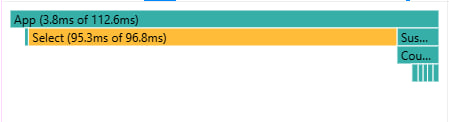
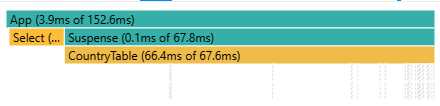
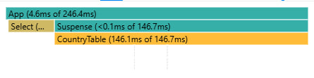
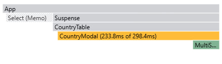

# Performance Profiling

Used React DevTools Profiler for next operations:

- sorting a table by name, population;

- searching a countryby name;

- selecting another year;

- open modal for yearly info.

Profiler saticstics without useMemo:

Profiler saticstics with useMemo:

